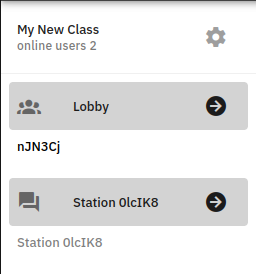

<!--

language: en

comment:  Edrys Tutorial

icon:     ./images/logo.png

-->


# Edrys Tutorial

A small tutorial for teachers, students, and developers to get started with Edrys.


## Teachers

The teacher is the one who creates the classroom and can open a station (the teacher can also be a student).

* **Create a classroom**

  - Open [Edrys-Lite](https://edrys-labs.github.io/) and click on `Create a class`.
  - The classroom is created with the starting reference module.

* **Add Modules**

  There are multiple ways to add modules to the classroom:

  - **Manually**: Open Settings => Modules, and paste the module URL.

    Some edrys modules can be found in: https://github.com/topics/edrys-module

    After adding a module, you can modify where it will be shown (lobby/station), modify its styling (widht/height), and add other settings.

  - **From an existing configuration**: Open Settings => Share, and import the configuration from a local file or a URL. 

    Some ready-to-use classroom configurations are available in the following repositories (You can also just click the deploy-button of the desired configuration):

    - https://github.com/edrys-labs/edrys-exercises
    - https://github.com/topics/edrys-lab
    - https://github.com/edrys-labs/lab-tubaf-embedded-systems

  * **Create your own configuration**: You can create your own configuration by creating a YAML file with the appropriate structure ([Example](https://github.com/edrys-labs/edrys-exercises/blob/main/labs/arduino_blink.yml)). And then import the configuration file in the classroom settings.

* **Open a Station**

  - The teacher can open a station. Settings => Stations => Open the station link.
  - The station is now available and the teacher can then share the classroom link with the students. 


### Arduino Labs 

In Arduino laboratories, the most used modules are the Code Editor and the Terminal.

* **For Linux users (recommended)**

  If you are running your station on a Linux machine, you can use the following modules:

  - **Code Editor**: https://github.com/edrys-labs/module-editor
  - **Terminal**: https://github.com/edrys-labs/module-pyxtermjs

* **For Windows users (limited)**
  
  If you are running your station on a Windows machine, you can use the following code editor (the terminal is not needed for this setup):
  
  - **Code Editor**: https://github.com/jh-488/Edrys_Code_Editor

  And you need to run the required server:

  - **Edrys NodeJs Server**: https://github.com/jh-488/edrys_server

## Students

The students receive the classroom link from the teacher (e.g. https://edrys-labs.github.io/?/classroom/Ovqd5ZBV3HVQ3seS) and can then access the stations.



* **Access a Station**

  - Click on the station arrow-button to access the station.
  - The student can now work on the exercises and tasks of the station.


## Developers

Each module is just an HTML page that is run in an iframe and shown to your students, teachers, and on stations. You can make the module behave differently depending on where it is currently loaded. Modules use the Edrys.js API to send and receive messages in real time, allowing you to build any live functionality without setting up any real-time infrastructure, authenticating users, or configuring anything else, as that is all handled upstream by Edrys.

The easiest way to start developing modules is to use the [Reference-Module](https://github.com/edrys-labs/module-reference) and follow the implementation of the different functions.

- Import the Edrys.js API in your module:

  ```html
  <script src="https://edrys-labs.github.io/module/edrys.js"></script>
  ```

- Listen to the module load and update events:

  ```javascript
  Edrys.onReady(() => console.log("Module is loaded!"));
  ``` 

  ```javascript
  Edrys.onUpdate(() => console.log("Something has changed in the class"));
  ```  

- Use the API to send and receive messages:

  ```javascript
  Edrys.sendMessage("subject", "body");
  ```
  
  ```javascript
  Edrys.onMessage(({ from, subject, body }) => {
    console.log("Got new message: ", from, subject, body)
  });
  ```

Other functions are available in the [Edrys.js API documentation](https://github.com/edrys-org/edrys/blob/main/docs/Modules.md) (This is not the final documentation, but it should give you a good overview of the available functions).